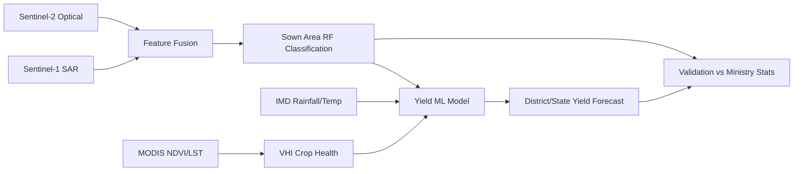

# CROP — Wheat Crop Monitoring (Rabi Season)

Satellite-based operational framework for **wheat sown area mapping, crop health monitoring, and yield forecasting** across 8 major wheat-growing Indian states.

- **Organisation:** ISRO / SAC (reference framework)
- **Category:** Agricultural Remote Sensing
- **Sensors:** Sentinel-1 SAR, Sentinel-2 optical, Resourcesat-2 AWiFS/LISS-III, MODIS, IMD meteorological data

## Architecture



## Repository layout

| Path | Purpose |
|---|---|
| `notebooks/01_aoi_and_data_acquisition.ipynb` | AOI definition (8 states), Rabi windows, S1/S2/MODIS acquisition, AWiFS & IMD loaders |
| `notebooks/02_sar_optical_fusion_sown_area.ipynb` | SAR-optical fusion, RF wheat classification, sown area (lakh ha), choropleth, phenology curves |
| `notebooks/03_vhi_crop_health_monitoring.ipynb` | VCI/TCI/VHI computation, fortnightly bulletins, heat stress hotspots |
| `notebooks/04_yield_forecast_ml.ipynb` | 5 km grid features, scikit-learn regression, district/state yield forecast |
| `notebooks/05_validation_and_reporting.ipynb` | Satellite vs ground-truth evaluation matrix, correlation scatter, bulletin report |
| `src/` | Reusable Python modules used by all notebooks |
| `config/config.yaml` | States, season windows, grid size, thresholds, hyperparameters |
| `data/sample/` | Sample district yield history & Ministry ground-truth CSVs (replace with real data) |

## Setup

```bash
pip install -r requirements.txt
```

Authenticate Google Earth Engine once:

```python
import ee
ee.Authenticate()
ee.Initialize()
```

Run notebooks in order `01 → 05`.

## Substituting real data

- **AWiFS/LISS-III:** place GeoTIFFs locally and use `src/io_utils.load_awifs_geotiff`. Note: AWiFS 56 m resolution causes **mixed-pixel anomalies** on smallholder plots — prefer Sentinel for plot-level mapping.
- **IMD gridded data:** NetCDF files via `src/io_utils.load_imd_netcdf`.
- **Ministry statistics:** replace `data/sample/*.csv` with official district tables (same column schema).

## Known constraints handled

- **Cloud cover (early Rabi):** SAR-first classification; optical used opportunistically with s2cloudless masking.
- **Heat stress anomalies:** IMD temperature integrated into VHI hotspot overlay and yield features.
