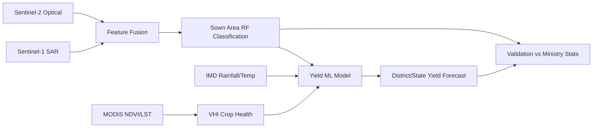

# CROP — Wheat Crop Monitoring (Rabi Season)

Satellite-based operational framework for **wheat sown area mapping, crop health monitoring, and yield forecasting** across 8 major wheat-growing Indian states.

- **Organisation:** ISRO / SAC (reference framework)
- **Category:** Agricultural Remote Sensing
- **Sensors:** Sentinel-1 SAR, Sentinel-2 optical, Resourcesat-2 AWiFS/LISS-III, MODIS, IMD meteorological data

## Architecture



## 📁 Repository Layout & Pipeline Details

### 📓 Baseline Pipeline Notebooks

#### `01_aoi_and_data_acquisition.ipynb`
- **What it does:** Defines the Areas of Interest (AOI) spanning 8 states and sets the Rabi season time windows. It acquires and preprocesses imagery from Sentinel-1 (SAR), Sentinel-2 (Optical), and MODIS. It also contains loaders for AWiFS and IMD meteorological gridded data.
- **Output:** Preprocessed satellite image collections, clipped to specific regions and timeframes, ready for feature extraction.

#### `02_sar_optical_fusion_sown_area.ipynb`
- **What it does:** Fuses SAR and Optical features to mitigate cloud-cover issues. It trains and applies a Random Forest (RF) classifier to identify wheat-growing pixels and generates phenology curves.
- **Output:** A classified sown area map (in lakh hectares) and district-wise choropleth maps depicting wheat crop distribution.

#### `03_vhi_crop_health_monitoring.ipynb`
- **What it does:** Computes the Vegetation Condition Index (VCI), Temperature Condition Index (TCI), and Vegetation Health Index (VHI) using MODIS NDVI and LST products. It identifies heat stress hotspots affecting crop vitality.
- **Output:** Fortnightly crop health bulletins and spatial maps highlighting regions undergoing heat/drought stress.

#### `04_yield_forecast_ml.ipynb`
- **What it does:** Aggregates satellite indices and meteorological parameters onto a 5 km grid. Uses scikit-learn regression models to forecast crop yield based on these spatial features.
- **Output:** Quantitative yield forecasts at both the district and state levels.

#### `05_validation_and_reporting.ipynb`
- **What it does:** Compares the model-derived sown area and yield estimates against official Ministry ground-truth statistics.
- **Output:** Evaluation matrices, correlation scatter plots, and a final automated bulletin report summarizing the season's findings.

---

### 🔬 Advanced Research-Grade Extensions (Notebooks)

These extensions upgrade the baseline from a standard machine-learning prototype to a sophisticated research-grade system.

#### `06_deep_learning_classification.ipynb`
- **What it does:** Implements Deep Satellite Image Time Series (SITS) classifiers as an alternative to Random Forest. Models include TempCNN, Transformers with self-attention, and a foundation-model head utilizing IBM/NASA's Prithvi.
- **Output:** Highly accurate, temporally-aware sown area classifications that leverage deep learning patterns over the growing season.

#### `07_phenology_and_unmixing.ipynb`
- **What it does:** Fits double-logistic curves on a per-pixel basis to track crop phenology stages accurately. Applies Fully-Constrained Least-Squares (FCLS) spectral unmixing to resolve 56 m mixed pixels from AWiFS data.
- **Output:** High-fidelity sub-pixel abundance maps and localized phenological metrics (e.g., peak vegetative stage, harvest onset).

#### `08_crop_model_assimilation_uncertainty.ipynb`
- **What it does:** Integrates a physical WOFOST-style crop growth simulator. It uses an Ensemble Kalman Filter (EnKF) to assimilate satellite-derived Leaf Area Index (LAI) into the model and calculates split-conformal uncertainty intervals.
- **Output:** A physically grounded yield estimate accompanied by rigorous uncertainty bounds (confidence intervals) for actionable decision-making.

---

### 💻 Source Code Modules (`src/`)

Reusable Python modules driving the notebooks and advanced algorithms.

- **`deep_models.py`**: Contains PyTorch implementations of TempCNN, TransformerSITS, and PrithviHead, along with dedicated training and evaluation loops.
- **`phenology.py`**: Functions for double-logistic curve fitting, extracting season metrics, and calculating NDVI integrals.
- **`unmixing.py`**: Logic for Fully-Constrained Least-Squares (FCLS) sub-pixel unmixing to address mixed-pixel anomalies.
- **`crop_model.py`**: A daily wheat growth simulator combining physical crop models with Ensemble Kalman Filter (EnKF) data assimilation.
- **`uncertainty.py`**: Implementations for split-conformal intervals, MC-dropout, and ensemble intervals to quantify yield prediction risks.
- **`io_utils.py`** *(referenced)*: Utility loaders for fetching local GeoTIFFs (like AWiFS) and IMD NetCDF files.

### ⚙️ Configuration & Data

- **`config/config.yaml`**: Centralized configuration containing state boundaries, season windows, grid sizes, classification thresholds, and ML hyperparameters.
- **`data/sample/`**: Sample district yield history and Ministry ground-truth CSV files (used as templates for real official data substitution).
- **`.gitlab-ci.yml`**: CI/CD pipeline definitions for linting, notebook/module smoke testing, and scheduling fortnightly operational runs.

## Setup

```bash
pip install -r requirements.txt
```

Authenticate Google Earth Engine once:

```python
import ee
ee.Authenticate()
ee.Initialize()
```

Run notebooks in order `01 → 05`.

## Substituting real data

- **AWiFS/LISS-III:** place GeoTIFFs locally and use `src/io_utils.load_awifs_geotiff`. Note: AWiFS 56 m resolution causes **mixed-pixel anomalies** on smallholder plots — prefer Sentinel for plot-level mapping.
- **IMD gridded data:** NetCDF files via `src/io_utils.load_imd_netcdf`.
- **Ministry statistics:** replace `data/sample/*.csv` with official district tables (same column schema).

## Known constraints handled

- **Cloud cover (early Rabi):** SAR-first classification; optical used opportunistically with s2cloudless masking.
- **Heat stress anomalies:** IMD temperature integrated into VHI hotspot overlay and yield features.
